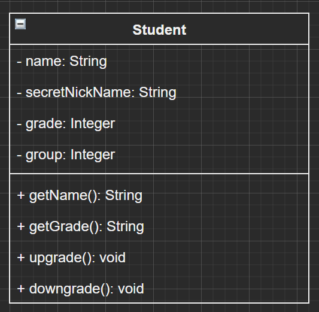

# Class Diagram &amp; Encapsulation Activity

## Exercise 1: Class Diagrams 
Read and study the following business requirement and acceptance criteria. 

### Business Requirement: 
We’ve just had a request from a school and they would like to track student grades for the Mathematics class. 
It’s the end of the school term and  the teacher would like to input the student grades into a system. 
They would like your help to design and code up a Java class to represent a  student. 
You can find the business acceptance criteria below: 

### Business Acceptance Criteria: 
- Your program must have a Student Java class 
  - A Student must have a name 
  - A Student must have a single grade 
    - The value for grade must be one of the following: A, B, C, D, E, F 
  - A Student must have a single group 
    - The value for group must be one of the following: 1, 2, 3, 4, 5 
  - A Student has a secretNickName and is set to “MySecretNickName” 
- The school should be able to initialise the Student Java Class with an initial value for name, grade and group. 
- The school should be able to get the Student’s grade securely 
- The school should be able to get the Student’s name securely 
- The school should NOT be able to get the Student’s secretNickName 
- The school should be able to call methods to upgrade and downgrade the Student’s grade. 
  - For example, if the Student has a current grade of “B”, an upgrade will result in the grade being set to “A”. 
  - If the Student has a current grade of “C”, a downgrade will result in the grade being set to “D”. 

### 1.1 Activity
- Using your understanding of access modifiers, getters and setters, 
draw a well-encapsulated class diagram to satisfy the business  acceptance criteria. 

## Exercise 2: Translate the Class Diagram into Code 
### 2.1 Activity
- Using your understanding of access modifiers, getters and setters, translate your class diagram from Exercise 1 into working Java  code.

## Activity 1: Class Diagrams

### 1.1 Class diagram
- Created [UML of Student Class](docs/StudentClassUML.drawio) in (https://app.diagrams.net/)
- Took a screen capture of [iniital UML of Student Class](docs/InitialStudentClassUML.png)

